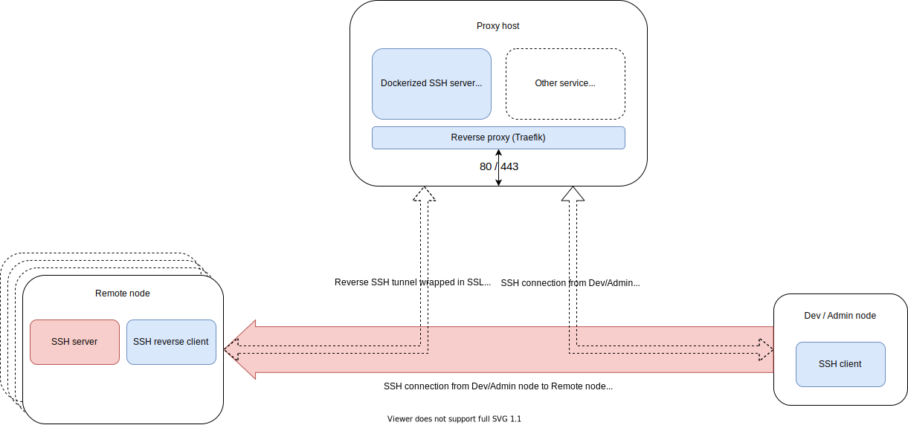

# sysmote
Blueprint and example configuration for a remote system administration setup using reverse SSH tunneling via a proxy host wrapped in SSL.



## Proxy host
* Traefik (for reverse proxying of HTTP and TCP traffic)
* Dockerized SSH server (acting as a proxy jump host with no access to the (Proxy host) host machine)

<details>
<summary>Example configuration:</summary> 

```yaml
version: "3"

services:

  traefik:
    image: "traefik:v2.5"
    container_name: "traefik"
    restart: unless-stopped
    command:
      #      - "--log.level=DEBUG"
      - "--providers.docker=true"
      - "--providers.docker.exposedbydefault=false"
      - "--entrypoints.web.address=:80"
      - "--entrypoints.web.http.redirections.entryPoint.to=websecure"
      - "--entrypoints.web.http.redirections.entryPoint.scheme=https"
      - "--entrypoints.websecure.address=:443"
      - "--certificatesresolvers.LEresolver.acme.httpchallenge=true"
      - "--certificatesresolvers.LEresolver.acme.httpchallenge.entrypoint=web"
      #      - "--certificatesresolvers.LEresolver.acme.caserver=https://acme-staging-v02.api.letsencrypt.org/directory"
      - "--certificatesresolvers.LEresolver.acme.email=<your_email>"
      - "--certificatesresolvers.LEresolver.acme.storage=/letsencrypt/acme.json"
    ports:
      - "80:80"
      - "443:443"
    volumes:
      - "./letsencrypt:/letsencrypt"
      - "/var/run/docker.sock:/var/run/docker.sock:ro"

  openssh:
    image: lscr.io/linuxserver/openssh-server
    container_name: openssh
    environment:
      - PUID=1000
      - PGID=1000
      - TZ=Europe/London
      - PUBLIC_KEY=yourpublickey #optional
      - PUBLIC_KEY_FILE=/path/to/file #optional
      - PUBLIC_KEY_DIR=/path/to/directory/containing/_only_/pubkeys #optional
      - PUBLIC_KEY_URL=https://github.com/username.keys #optional
      - SUDO_ACCESS=false #optional
      - PASSWORD_ACCESS=false #optional
      - USER_PASSWORD=password #optional
      - USER_PASSWORD_FILE=/path/to/file #optional
      - USER_NAME=linuxserver.io #optional
      - DOCKER_MODS=linuxserver/mods:openssh-server-ssh-tunnel
    restart: unless-stopped
    labels:
      - "traefik.enable=true"
      - "traefik.tcp.routers.sysmote.rule=HostSNI(`sysmote.example.com`)"
      - "traefik.tcp.routers.sysmote.entrypoints=websecure"
      - "traefik.tcp.routers.sysmote.tls.certresolver=LEresolver"
      - "traefik.tcp.routers.sysmote.service=sysmote_service"
      - "traefik.tcp.services.sysmote_service.loadbalancer.server.port=2222"
```
</details>


## Remote node
* SSH server
* SSH client
* openSSL

The following ssh command can be used to connect to the proxy host and open a reverse tunnel:
```
ssh -N -T -R localhost:53022:localhost:22 -o ProxyCommand="openssl s_client -quiet -connect sysmote.example.com:443 -servername sysmote.example.com" sysmote@sysmote
```

This can (should) be used in a setup with automatic alive checks and reconnections, such as `systemd` (note: this also requires authentication to be performed using a public/private key pair):
```
[Unit]
Description=Sysmote reverse tunnel connection
After=network.target

[Service]
Type=simple
ExecStart=/usr/bin/ssh -vvv -N -T -o ServerAliveInterval=10 -o ExitOnForwardFailure=yes -o -o ProxyCommand="openssl s_client -quiet -connect sysmote.example.com:443 -servername sysmote.example.com" -R localhost:53022:localhost:22 sysmote@sysmote
Restart=always
RestartSec=5s
RuntimeMaxSec=86400

[Install]
WantedBy=default.target
```


## Dev / Admin node
* SSH client
* openSSL

The following ssh config file will make it possible to connect to a remote node:

```
Host proxy-host
    HostName sysmote
    User sysmote
    ProxyCommand openssl s_client -quiet -connect sysmote.example.com:443 -servername sysmote.example.com

Host remote-node
    Hostname localhost
    Port 53022
    ProxyJump proxy-host
    User <user-for-remote-node>
```

Using this command:
```
ssh remote-node
```

## Notes:
* In general, use public/private key pairs for authentication instead of username/password for all SSH connections.
* To administrate multiple remote nodes, each node must use separate port numbers for their reverse tunnels.
* Traefik is capable of running the openssh-tcp-router setup alongside any other http/https services running on the same "proxy host".
